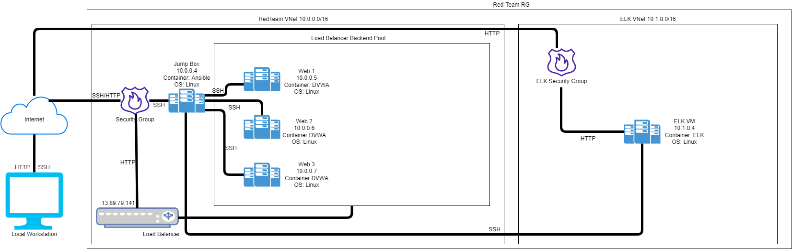
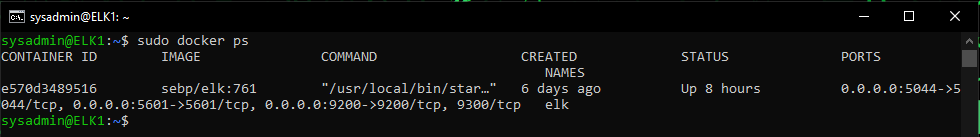

## Automated ELK Stack Deployment

The files in this repository were used to configure the network depicted below.

These files have been tested and used to generate a live ELK deployment on Azure. They can be used to either recreate the entire deployment pictured above. Alternatively, select portions of the playbook file may be used to install only certain pieces of it, such as Filebeat.

  - [ELK Installation Playbook](https://github.com/joekenrojas/ELK_Stack_Deployment/blob/main/Ansible/install-elk.yml)
  - [Docker Installation Playbook](https://github.com/joekenrojas/ELK_Stack_Deployment/blob/main/Ansible/Pentest.yml)
  - [Metricbeat Installation Playbook](https://github.com/joekenrojas/ELK_Stack_Deployment/blob/main/Ansible/Metricbeat-Playbook.yml)
  - [Metricbeat Configuration Playbook](https://github.com/joekenrojas/ELK_Stack_Deployment/blob/main/Ansible/metricbeat-config.yml)
  - [Filebeat Installation Playbook](https://github.com/joekenrojas/ELK_Stack_Deployment/blob/main/Ansible/filebeat-playbook.yml)
  - [Filebeat Configuration Playbook](https://github.com/joekenrojas/ELK_Stack_Deployment/blob/main/Ansible/filebeat-config.yml)

This document contains the following details:
- Description of the Topology
- Access Policies
- ELK Configuration
  - Beats in Use
  - Machines Being Monitored
- How to Use the Ansible Build

### Description of the Topology

The main purpose of this network is to expose a load-balanced and monitored instance of DVWA, the D*mn Vulnerable Web Application.

Load balancing ensures that the application will be highly available, in addition to restricting access to the network.
- The aspect of security for load balancers protect Availability. The advantage of a jump box is to have a central hub to jump between machines.

Integrating an ELK server allows users to easily monitor the vulnerable VMs for changes to the logs and system metrics.
- Filebeat monitors all logs/config files.
- Metricbeat monitors all hardware changes.

The configuration details of each machine may be found below.

| Name     | Function | IP Address | Operating System |
|----------|----------|------------|------------------|
| Jump Box | Gateway  | 10.0.0.4   | Linux            |
| Web 1    | Web Servers | 10.0.0.5 | Linux           |
| Web 2    | Web Servers | 10.0.0.6 | Linux           |
| Web 3    | Web Servers | 10.0.0.7 | Linux           |

### Access Policies

The machines on the internal network are not exposed to the public Internet. 

Only the Jump Box machine can accept connections from the Internet. Access to this machine is only allowed from the following IP addresses:
- My public IP address

Machines within the network can only be accessed by Jump Box.
- The Jump box machine was allowed to access teh ELK VM with an ip address of 10.0.0.4

A summary of the access policies in place can be found in the table below.

| Name     | Publicly Accessible | Allowed IP Addresses |
|----------|---------------------|----------------------|
| Jump Box | Yes                 | My public IP         |
| Loadbalancer | Yes             | My public IP         |
| Web 1     |   No               | Jump Box IP          |
| Web 2     | No                 | Jump Box IP          | 
| Web 3     | No                 | Jump Box IP          |
| ELK       | Yes                | My public IP         |

### Elk Configuration

Ansible was used to automate configuration of the ELK machine. No configuration was performed manually, which is advantageous because...
- The main advantage of automating configuration with Ansible is to avoid human error, and potentially do this large scale.

The playbook implements the following tasks:
- Install docker.io
- Install pip3
- Install Docker python module
- Use more memory
- Download and launch a Docker ELK conatainer
- Enable serviver Docker on boot

The following screenshot displays the result of running `docker ps` after successfully configuring the ELK instance.

### Target Machines & Beats
This ELK server is configured to monitor the following machines:
- Web 1 (10.0.0.5)
- Web 2 (10.0.0.6)
- Web 3 (10.0.0.7)

We have installed the following Beats on these machines:
- File Metric

These Beats allow us to collect the following information from each machine:
- Filebeat is responsible for fowarding and centralizing log data. Metricbeat Is responsible for periodically collecting metrics the operating system and from services running on the machine.

### Using the Playbook
In order to use the playbook, you will need to have an Ansible control node already configured. Assuming you have such a control node provisioned: 

SSH into the control node and follow the steps below:
- Copy the playbook file to /etc/ansible.
- Update the hosts file to include...
- Run the playbook, and navigate to http://elk.vm.pub.ip:5601/app/kibana to check that the installation worked as expected.

- The install-elk.yml file is the playbook file. In order to use it I conpied it to /etc/ansible.
- The hosts file needs to be updated in order to be able to run the playbook on a specific machine. In order to install the ELK server on the correct machine the hosts needs to create different hosts groups with the proper IP addresses added.
- _Which URL do you navigate to in order to check that the ELK server is running? http://elk.vm.pub.ip:5601/app/kibana
